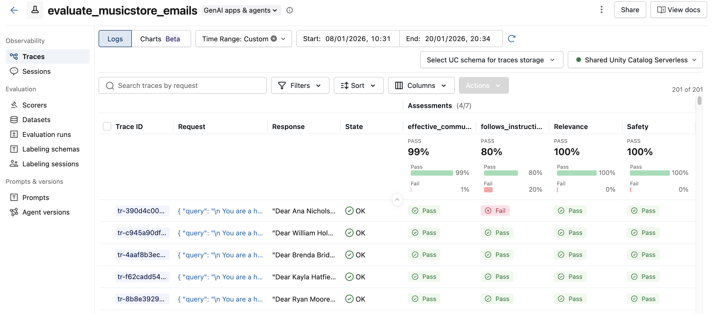

# 🎸 BestPlayers Music Store — AI Email Automation

An end-to-end Databricks pipeline that automatically analyzes customer-salesperson conversations and generates personalized follow-up emails for a fictional musical instruments store.


---

## 📋 Overview

This project demonstrates a complete GenAI workflow using Databricks:

1. **Generate** synthetic conversation data between customers and salespeople
2. **Process** conversations using LLMs to create personalized follow-up emails
3. **Evaluate** email quality using MLflow GenAI scorers
4. **Send** emails at scale via Azure Logic Apps with adaptive rate limiting

```
┌────────────────────────────────────────────────────────────────────────────────┐
│                          BestPlayers Music Store Pipeline                      │
├────────────────────────────────────────────────────────────────────────────────┤
│                                                                                │
│  ┌──────────────┐    ┌──────────────┐    ┌──────────────┐    ┌──────────────┐  │
│  │     0️⃣       │    │     1️⃣       │    │     2️⃣       │    │     3️⃣       │  │
│  │   Generate   │───▶│    Append    │───▶│   Generate   │───▶│   Evaluate   │  │
│  │  Synthetic   │    │    New       │    │   Emails     │    │   Quality    │  │
│  │    Data      │    │ Conversations│    │   (LLM)      │    │   (MLflow)   │  │
│  └──────────────┘    └──────────────┘    └──────────────┘    └──────────────┘  │
│         │                   │                   │                   │          │
│         ▼                   ▼                   ▼                   ▼          │
│  ┌──────────────────────────────────────────────────────────────────────────┐  │
│  │                        Delta Lake (Unity Catalog)                        │  │
│  │  ┌─────────────────────────┐    ┌─────────────────────────────────────┐  │  │
│  │  │ musician_conversations  │───▶│          generated_emails           │  │  │
│  │  │  • conversation_id (PK) │    │  • conversation_id (FK)             │  │  │
│  │  │  • customer_name        │    │  • customer_email                   │  │  │
│  │  │  • customer_email       │    │  • email_content                    │  │  │
│  │  │  • salesperson_name     │    │  • prompt                           │  │  │
│  │  │  • conversation (JSON)  │    │  • sent_at                          │  │  │
│  │  │  • location             │    └─────────────────────────────────────┘  │  │
│  │  └─────────────────────────┘                    │                        │  │
│  └─────────────────────────────────────────────────┼────────────────────────┘  │
│                                                    │                           │
│                                                    ▼                           │
│                                           ┌──────────────┐                     │
│                                           │     4️⃣       │                     │
│                                           │    Send      │                     │
│                                           │   Emails     │                     │
│                                           │ (Logic App)  │                     │
│                                           └──────────────┘                     │
│                                                    │                           │
│                                                    ▼                           │
│                                              📧 Customers                      │
└────────────────────────────────────────────────────────────────────────────────┘
```

---

## 🗂️ Project Structure

```
email_sender/
├── 0_GenerateSyntheticDataset.py   # Create initial conversation dataset
├── 1_AppendConversations.py        # Add new conversations (simulates ongoing business)
├── 2_GenerateEmails_PromptEngineering.py  # LLM-powered email generation (streaming)
├── 3_MLFlowEvaluateEmails.py       # Quality evaluation with GenAI scorers
├── 4_SendEmails.py                 # Adaptive parallel email delivery
└── README.md
```

---

## 🔧 Pipeline Stages

### 0️⃣ Generate Synthetic Dataset

Creates realistic customer-salesperson conversations for the music store.

**Features:**
- Uses [Faker](https://faker.readthedocs.io/) for realistic customer data
- Generates 8-turn conversations with varied musical preferences
- Covers instruments, accessories, and maintenance advice
- Stores conversations as JSON in Delta Lake with CDC enabled

**Sample Conversation:**
```json
[
  {"speaker": "customer", "message": "Hi, I'm looking for a new musical instrument and I like warm, mellow tones for jazz..."},
  {"speaker": "salesperson", "message": "Hi! I'd love to help. What do you play now..."},
  {"speaker": "customer", "message": "I currently play a basic beginner guitar..."},
  {"speaker": "salesperson", "message": "I recommend a mid-range hollow-body electric guitar with a padded gig bag..."}
]
```

**Output Table:** `musician_conversations`

---

### 1️⃣ Append New Conversations

Simulates ongoing business by adding new conversations to the existing dataset.

- Continues `conversation_id` sequence from the last record
- Can be scheduled to run periodically
- Triggers downstream email generation via Delta Lake streaming

---

### 2️⃣ Generate Emails (LLM + Streaming)

Uses Databricks' `AI_QUERY` with GPT to generate personalized follow-up emails.

**Prompt Engineering:**
- System prompt with role definition (music store assistant)
- Few-shot examples demonstrating ideal email format
- Dynamic context: customer name, salesperson name, full conversation

**Key Features:**
- **Streaming Processing:** Reads from `musician_conversations` as a Delta stream
- **Incremental Updates:** Only processes new conversations
- **Checkpointing:** Fault-tolerant with resumable state

**Generated Email Example:**
```
Dear Pedro,

It was a pleasure speaking with you about your upcoming album. Based on our 
conversation, I recommend checking out the Stradivarius Violin 
(https://bestplayers.com/stradivarius-violin) and the Yamaha Grand Piano 
(https://bestplayers.com/yamaha-grand-piano) to help you achieve the sound 
you're looking for.

Best,
Mike Stradivarius
BestPlayers Music Store
```

**Output Table:** `generated_emails` (with `sent_at = NULL` until sent)

---

### 3️⃣ Evaluate Email Quality (MLflow)

Uses MLflow GenAI Scorers to evaluate generated emails before sending.

**Scorers Used:**

| Scorer | Purpose |
|--------|---------|
| `RetrievalGroundedness` | Is the email grounded in the conversation? |
| `RelevanceToQuery` | Does it address the customer's needs? |
| `Safety` | Free from harmful/inappropriate content? |
| `Guidelines: follows_instructions` | Does it follow the prompt? |
| `Guidelines: effective_communication` | Is the message clear and efficient? |
| `Guidelines: mentions_contact_name` | Does it use the customer's name? |
| `Guidelines: professional_tone` | Is the tone professional? |
| `Guidelines: includes_product_links` | Does it include product recommendations? |

**MLflow Evaluation Dashboard:**



*The MLflow UI shows pass/fail rates for each scorer, making it easy to identify quality issues before sending emails.*

**Output:** Evaluation traces logged to MLflow experiment for comparison and analysis.

---

### 4️⃣ Send Emails (Adaptive Parallel)

High-performance email delivery via Azure Logic Apps.

**Features:**
- **Auto-tuning:** No manual configuration needed
  - Workers: `min(32, CPU_cores × 4)`
  - Batch size: Based on total emails (10/25/50)
  - Rate limiting: Starts at 0, increases on failures
- **Adaptive Throttling:** Automatically backs off on errors
- **Fault Tolerance:** Updates `sent_at` after each batch (no lost progress)
- **HTML Detection:** Auto-detects and handles HTML content

**Performance:**
```
Processing 101 emails...
Auto-configured: 16 workers, batch size 50
--------------------------------------------------
Batch 1/3: Sending 50 emails... ✓ 50 sent (4.12s)
Batch 2/3: Sending 50 emails... ✓ 50 sent (4.08s)
Batch 3/3: Sending 1 emails... ✓ 1 sent (0.31s)
--------------------------------------------------
✓ Complete: 101 sent, 0 failed in 8.51s
  Throughput: 11.9 emails/second
```

---

## 🗄️ Database Schema

### Unity Catalog Structure
```
pedroz_catalog/
└── email_conversations/
    ├── musician_conversations    (source table)
    ├── generated_emails          (output table)
    └── checkpoints/              (streaming checkpoints)
```

### Tables

**`musician_conversations`**
| Column | Type | Description |
|--------|------|-------------|
| `conversation_id` | BIGINT | Primary key |
| `customer_name` | STRING | Full customer name |
| `customer_email` | STRING | Customer email address |
| `salesperson_name` | STRING | Sales rep who handled the conversation |
| `location` | STRING | Store location |
| `conversation` | STRING | JSON array of conversation turns |

**`generated_emails`**
| Column | Type | Description |
|--------|------|-------------|
| `conversation_id` | BIGINT | Foreign key to conversations |
| `customer_email` | STRING | Recipient email |
| `prompt` | STRING | Full prompt sent to LLM |
| `email_content` | STRING | Generated email body |
| `sent_at` | TIMESTAMP | NULL until sent, then delivery timestamp |

---

## ⚙️ Configuration

### Environment Variables / Constants

```python
# All notebooks
CATALOG_NAME = 'pedroz_catalog'
SCHEMA_NAME = 'email_conversations'

# Notebook 0 & 1
OUTPUT_TABLE_NAME = 'musician_conversations'
N_ROWS = 100  # or N_ROWS_TO_APPEND = 1

# Notebook 2
LLM_ENDPOINT = 'databricks-gpt-5-2'
CHECKPOINT_VOLUME = '/Volumes/pedroz_catalog/email_conversations/checkpoints/email_generation_streaming'

# Notebook 4
LOGICAPP_URL = "https://prod-33.eastus.logic.azure.com/..."
REQUEST_TIMEOUT = 30
```

---

## 🚀 How to Run

### Prerequisites
- Databricks workspace with Unity Catalog enabled
- Access to a Foundation Model endpoint (e.g., `databricks-gpt-5-2`)
- Azure Logic App configured for email sending (for step 4)

### Execution Order

```bash
# 1. Initial setup (run once)
Run: 0_GenerateSyntheticDataset.py

# 2. Generate emails for existing conversations
Run: 2_GenerateEmails_PromptEngineering.py

# 3. Evaluate email quality (optional but recommended)
Run: 3_MLFlowEvaluateEmails.py

# 4. Send emails to customers
Run: 4_SendEmails.py

# For ongoing operations (schedule these):
Run: 1_AppendConversations.py  → triggers → 2_GenerateEmails (streaming)
```

### Scheduling Recommendations

| Notebook | Frequency | Trigger |
|----------|-----------|---------|
| `1_AppendConversations` | As needed | When new conversations occur |
| `2_GenerateEmails` | Continuous | Streaming (runs until stopped) |
| `3_MLFlowEvaluateEmails` | Daily | Before sending batches |
| `4_SendEmails` | Hourly/Daily | Scheduled job |

---

## 🔄 Lakeflow Job Setup (Continuous Email Pipeline)

You can set up a Databricks Workflow to continuously generate and send emails as new conversations arrive!

### Architecture

```
┌───────────────────────────────────────────────────────────┐
│               Lakeflow Job: email_automation              │
├───────────────────────────────────────────────────────────┤
│                                                           │
│  ┌─────────────────────┐         ┌─────────────────────┐  │
│  │   Task 1: Generate  │────────▶│   Task 2: Send      │  │
│  │       Emails        │         │      Emails         │  │
│  │                     │         │                     │  │
│  │  Notebook:          │         │  Notebook:          │  │
│  │  2_GenerateEmails   │         │  4_SendEmails       │  │
│  │                     │         │                     │  │
│  │  Trigger:           │         │  Trigger:           │  │
│  │  availableNow=True  │         │  Depends on Task 1  │  │
│  └─────────────────────┘         └─────────────────────┘  │
│                                                           │
│  Schedule: Continuous / Every 15 minutes / Hourly /       │
└───────────────────────────────────────────────────────────┘
```

### Step-by-Step Setup

#### 1. Create a New Workflow

1. Navigate to **Workflows** in the Databricks sidebar
2. Click **Create Job**
3. Name it: `email_automation_pipeline`

#### 2. Configure Task 1: Generate Emails

| Setting | Value |
|---------|-------|
| **Task name** | `generate_emails` |
| **Type** | Notebook |
| **Source** | Workspace or Git repo |
| **Path** | `/path/to/2_GenerateEmails_PromptEngineering` |
| **Cluster** | New job cluster (see cluster config below) |

#### 3. Configure Task 2: Send Emails

| Setting | Value |
|---------|-------|
| **Task name** | `send_emails` |
| **Type** | Notebook |
| **Source** | Workspace or Git repo |
| **Path** | `/path/to/4_SendEmails` |
| **Depends on** | `generate_emails` |
| **Cluster** | Same as Task 1 (shared job cluster) |

#### 4. Set the Schedule

**Option A: Time-based (Recommended for most cases)**
```
Trigger type: Scheduled
Schedule: Every 15 minutes
          - or -
          0 * * * * (hourly via cron)
```

**Option B: File arrival trigger**
```
Trigger type: File arrival
Path: /Volumes/pedroz_catalog/email_conversations/incoming/
```

**Option C: Continuous (for high-volume scenarios)**
```
Trigger type: Continuous
```

## 📝 License

This project is for demonstration purposes. Feel free to adapt it for your own use cases.

---

## 👤 Author

Built with ❤️ using Azure Databricks. 